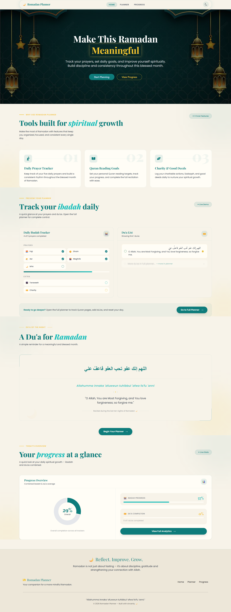

# 🌙 Ramadan Planner  
A Modern Spiritual Productivity & Progress Tracking Web Application

## 📌 Overview

Ramadan Planner is a frontend-focused productivity web application designed to help users organize their daily ibadah, track dua completion, and visualize spiritual progress throughout Ramadan.

The project emphasizes clean architecture, scalable state management, derived analytics, and polished UI/UX implementation using modern React ecosystem tools.

---

## 🎯 Problem It Solves

During Ramadan, users often:
- Struggle to consistently track daily ibadah
- Lose visibility of overall spiritual progress
- Lack structured planning tools

Ramadan Planner provides:
- Structured daily planning
- Completion tracking
- Real-time progress visualization
- Motivational feedback through analytics

---

## 🚀 Live Demo

    🔗 Live Site: https://ramadan-planner-web.netlify.app/  

    🔗 Repository: https://github.com/tasniazannat65/romadan-planner.git

---

## 🛠 Tech Stack

**Frontend**
- React.js
- React Router v6
- Redux Toolkit

**State Management**
- Global state using Redux
- Derived state using selectors
- Persistent state via localStorage

**UI & Styling**
- Tailwind CSS
- DaisyUI
- Responsive layout (Mobile-first design)

**Data Visualization**
- Recharts (Dynamic Pie Chart Analytics)

---

## 🧠 Core Features

### 🕌 1. Daily Planner System
- Add ibadah tasks
- Mark tasks as completed
- Add dua entries
- Real-time UI updates via Redux

### 📊 2. Progress Analytics Dashboard
- Ibadah completion percentage
- Dua completion percentage
- Overall progress calculation
- Dynamic Pie Chart rendering
- Automatic recalculation using selectors

### 🏠 3. Structured Home Experience
- Hero Section
- Feature Highlights
- Planner Preview
- Progress Overview (Mini Analytics Preview)
- Motivational Dua Section

### 🌙 4. Ramadan Themed UX
- Custom crescent loading spinner for route transitions
- Theme-consistent color system
- Clean spiritual aesthetic
- Smooth navigation experience

### 💾 5. Persistent State Management
- Custom `loadState` and `saveState` logic
- Redux store persistence via localStorage
- No backend required
- Data remains after refresh

---

### Key Architectural Decisions

- Separation of UI and state logic
- Redux slices for domain-specific logic
- Selectors for derived calculations
- Lightweight custom persistence layer
- Route-level loading UX enhancement

---

## 📈 Progress Calculation Logic

- Ibadah Completion = Completed Ibadah / Total Ibadah
- Dua Completion = Completed Dua / Total Dua
- Overall Progress = Average of Ibadah & Dua percentage
- Real-time recalculation triggered by Redux state updates

---

## 🎨 UX Design Considerations

- Minimal but meaningful CTAs
- Logical section hierarchy
- Motivational flow: Plan → Reflect → Measure
- Clean and distraction-free interface
- Avoided overuse of animations
- Route-level custom loading for smooth experience

---

## 📚 What This Project Demonstrates

✔ Advanced Redux state management  
✔ Derived state via selectors  
✔ Custom state persistence implementation  
✔ Data visualization integration  
✔ Component-driven architecture  
✔ UX-driven layout decisions  
✔ Product-level thinking  

---

## 🔮 Potential Future Improvements

- User authentication
- Backend integration (Node / Firebase)
- Streak tracking system
- Quran / Hadith API integration
- Multi-user support

---
## 📸 Screenshots

---

## 👨‍💻 Author

Tasnia Zannat  
Frontend Developer  

GitHub: (https://github.com/tasniazannat65)  
LinkedIn: (https://www.linkedin.com/in/tasnia-zannat/)

---

## 📄 License

MIT License